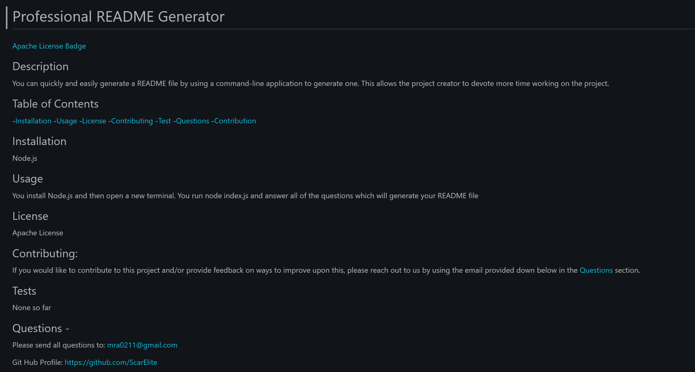

# Professional README Generator

## About the Project

This application was created to provide you with an easy to use README.md generator. Simply run node index.js in the command line and answer all of the questions that are provided. Once every thing is answered a README.md will be generated for you to use.

## Built With:

- JavaScript

## Installation requirements

This application is dependant on Node.js and will not work without it.

## Here's a preview of what your Professional README.md might look like!

## Contribution:

Made by Mitchell Armstrong

## Contact

Mitchell Armstrong - mra0211@gmail.com
